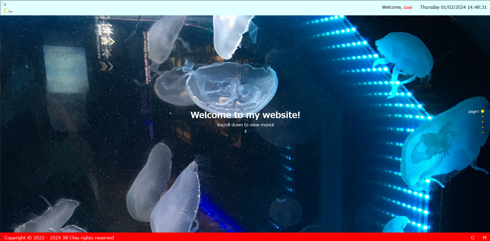

# Personal Portfolio Website

A full-stack personal portfolio website built with PHP and MySQL.

The project includes user authentication, contact form handling, portfolio presentation, and profile management. It was developed in 2022 as one of my earliest full-stack web applications and represents the starting point of my software development journey.

## Screenshot



## Features

### Personal Introduction
* About me page
* Profile / resume page
* Personal interests and background

### Portfolio Showcase
* Display previous projects
* Interactive presentation using fullPage.js

### Session-based authentication

* User registration
* Login / logout
* Profile management
* Password reset

### Contact form with server-side validation

* Input validation
* Email format verification
* Message persistence using MySQL

## Tech Stack

| Category | Technology |
|----------|------------|
| Frontend | HTML, CSS, JavaScript, jQuery |
| Backend | PHP |
| Database | MySQL |
| Libraries | fullPage.js, animate.css |

## Database Design

The system uses MySQL with two main tables:

### user

Stores user account information.

Fields:
* user_id
* user_name
* user_password
* user_email
* user_type

### contact

Stores messages submitted from contact form.

Fields:
* id
* name
* email
* message
* date


## Project Structure

```text
.
├── index.php          # Home page
├── about.php          # About page
├── profile.php        # Resume
├── portfolio.php      # Portfolio showcase
├── contact.php        # Contact form
├── header.php         # Shared header
├── footer.php         # Shared footer
├── script.js          # Frontend interactions
├── main.css           # Styling
└── database.sql
```

## Implementation Details

### Authentication Flow

1. User submits login/register form
2. PHP validates input
3. User data is checked against MySQL database
4. Session is created after successful login

### Contact Form

The contact system validates:

* Empty input
* Invalid email format
* Database insertion errors

Submitted messages are stored in MySQL.

## What I Learned

* Building a complete web application with PHP and MySQL
* Designing relational databases
* Managing sessions and authentication
* Server-side form validation
* Combining frontend interaction with backend processing

## Limitations & Future Improvements

This project was developed as a learning project.

Possible improvements:

* Replace raw SQL queries with prepared statements
* Hash passwords using password_hash()
* Separate frontend and backend logic
* Implement MVC architecture
* Improve responsive design
* Add better error handling
* Add multilingual support

## Architecture

```text
Client (HTML/CSS/JavaScript)
        │
        ▼
PHP Application
        │
        ▼
MySQL Database
```

## Development Journey

This project marks the beginning of my software development journey.

Since completing it, I have shifted my focus toward modern frontend development with React and TypeScript, learning component-based architecture, reusable hooks, API abstraction, state management, and type-safe application design.

Although this project contains legacy implementations, I keep it public as a record of my growth as a developer.

## Highlights

- Built a complete PHP + MySQL web application from scratch
- Implemented session-based authentication
- Integrated frontend animations with jQuery and fullPage.js
- Designed MySQL schema for user and contact management
- Developed reusable header/footer components